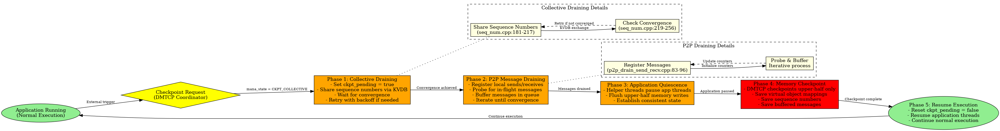
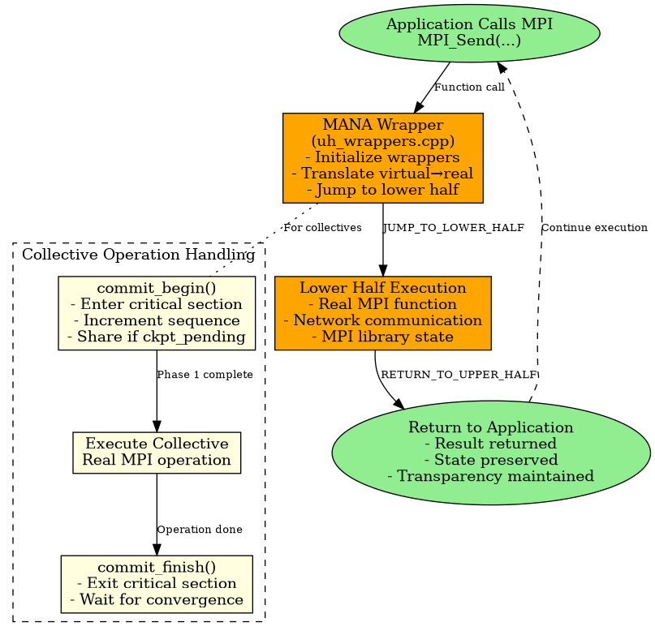
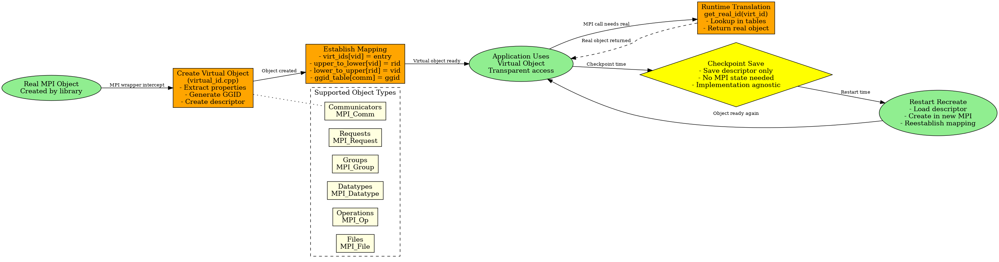

# NCCL Experiment Repository

This repository contains documentation and implementations for three major projects:

## [CRAC Documentation](crac/docs/)
CRAC (Checkpoint/Restart As a C library) provides checkpoint/restart functionality for HPC applications.

## [DMTCP Documentation](dmtcp/)
DMTCP (Distributed MultiThreaded Checkpointing) provides transparent checkpoint/restart functionality for distributed applications.

## [MANA Documentation](mana/docs/)
MANA: MPI-Agnostic, Network-Agnostic Transparent Checkpointing

The checkpointing process in MANA follows a carefully orchestrated multi-phase approach to ensure application state consistency while maintaining transparency.

## Process Flows

### Restart Process Flow

The restart process reconstructs the entire application state from checkpoint files while potentially using different MPI implementations or network fabrics.

### MPI Call Interception Flow

Every MPI call goes through MANA's interception layer to provide transparency and enable checkpointing.

### Virtual Object Management Flow

Virtual objects enable MANA's MPI/network agnosticism by abstracting implementation details.

