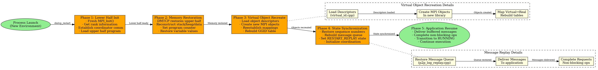

# NCCL Experiment Repository

## MANA: MPI-Agnostic, Network-Agnostic Transparent Checkpointing

The checkpointing process in MANA follows a carefully orchestrated multi-phase approach to ensure application state consistency while maintaining transparency.

## Process Flows

### Restart Process Flow

The restart process reconstructs the entire application state from checkpoint files while potentially using different MPI implementations or network fabrics.

### MPI Call Interception Flow

Every MPI call goes through MANA's interception layer to provide transparency and enable checkpointing.

### Virtual Object Management Flow

Virtual objects enable MANA's MPI/network agnosticism by abstracting implementation details.

## Detailed Documentation

For comprehensive technical details, architecture explanations, and implementation specifics, please refer to:

**[MANA_CODEBASE_SUMMARY.md](MANA_CODEBASE_SUMMARY.md)**
