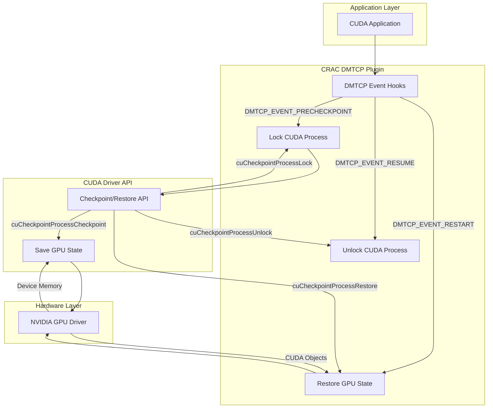
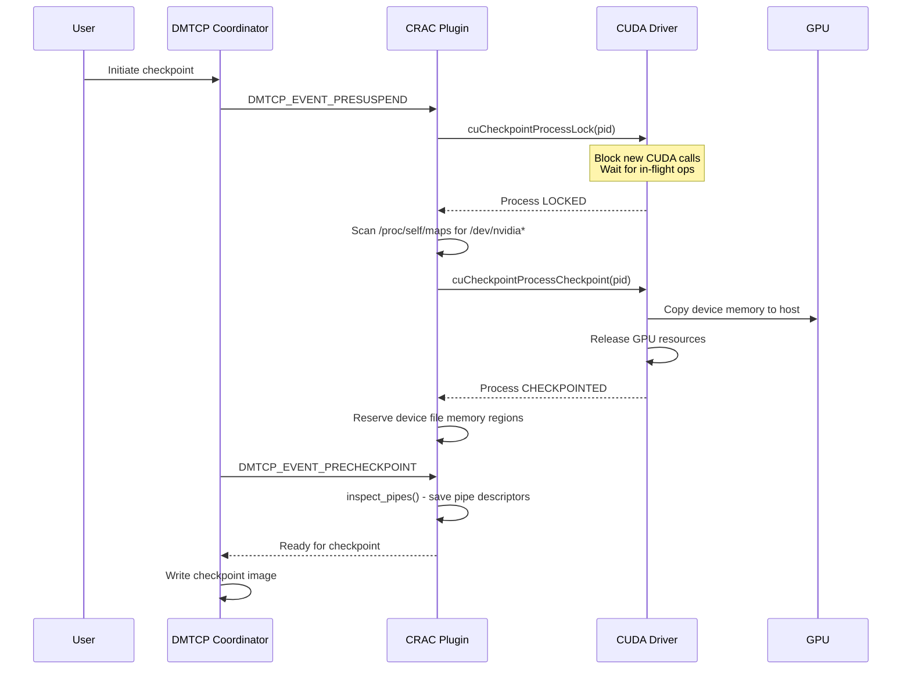
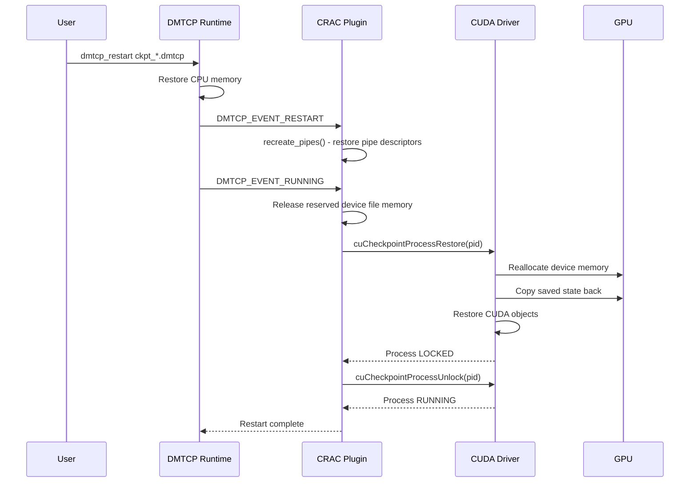
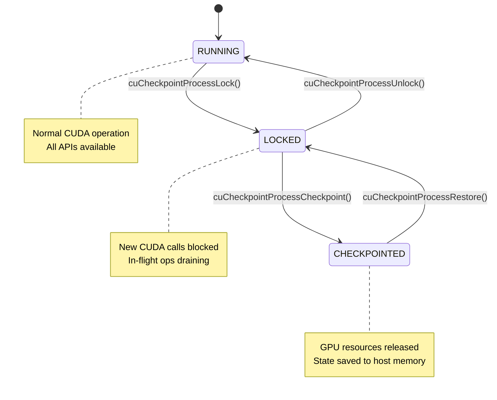

# CRAC (Checkpoint-Restart Architecture for CUDA) Contributor Documentation

## Table of Contents
1. [High-Level Architecture Overview](#high-level-architecture-overview)
2. [Repository Structure Analysis](#repository-structure-analysis)
3. [Data Flow Diagrams](#data-flow-diagrams)
4. [CUDA Checkpoint API Deep Dive](#cuda-checkpoint-api-deep-dive)
5. [DMTCP Plugin Integration](#dmtcp-plugin-integration)
6. [Build System Documentation](#build-system-documentation)
7. [Usage Guide](#usage-guide)
8. [Test Suite Documentation](#test-suite-documentation)
9. [Limitations and Known Issues](#limitations-and-known-issues)
10. [Comparison with Split-Process CRAC](#comparison-with-split-process-crac)
11. [Contributing Guide](#contributing-guide)
12. [Glossary](#glossary)

---

## High-Level Architecture Overview

CRAC is a **DMTCP plugin** that enables transparent checkpoint-restart for CUDA applications using **NVIDIA's native CUDA checkpoint/restart API** introduced in CUDA 12.4 (driver version 550+). This represents a paradigm shift from earlier split-process architectures by leveraging driver-level checkpoint/restore functionality.

### Architecture Diagram



### Key Design Principles

1. **Transparency**: Applications require no code modifications
2. **Native Integration**: Uses NVIDIA's official checkpoint API instead of custom interception
3. **DMTCP Compatibility**: Integrates seamlessly with DMTCP's distributed checkpointing
4. **Resource Management**: Handles device file reservation and pipe recreation automatically

---

## Repository Structure Analysis

```
crac/
├── crac.cpp           # Main plugin implementation (357 lines)
├── Makefile           # Build configuration (66 lines)
├── README.md          # Basic usage instructions (16 lines)
├── .gitignore         # Git ignore patterns (7 lines)
└── test/              # Test applications
    ├── Makefile       # Test build configuration (33 lines)
    ├── counter.cu     # Simple CUDA counter test (20 lines)
    ├── counter_mpi.cu # MPI+CUDA counter test (23 lines)
    └── mpi_cuda.cu    # Distributed vector addition (155 lines)
```

### File-by-File Analysis

#### `crac.cpp` - Main Plugin Implementation

**Purpose**: Core DMTCP plugin implementing CUDA checkpoint/restart functionality.

**Key Components**:

- **Global State Variables** (lines 48-53):
  ```cpp
  std::vector<ProcMapsArea> nvidia_device_files;  // Tracks device file mappings
  CUprocessState cuda_state = CU_PROCESS_STATE_RUNNING;  // Current CUDA process state
  CUcheckpointRestoreArgs restore_args = {0};     // Arguments for restore operation
  int cuda_initialized = 0;                       // CUDA driver initialization flag
  pipe_info_t pipe_list[MAX_PIPE_FDS];            // Tracks pipe file descriptors
  ```

- **Pipe Management Functions**:
  - `inspect_pipes()` (lines 56-92): Scans `/proc/self/fd` for pipe descriptors
  - `recreate_pipes()` (lines 94-170): Recreates pipes after restart with preserved inodes

- **GPU Checkpoint Functions**:
  - `checkpoint_gpu()` (lines 195-245): Locks and checkpoints GPU state
  - `restore_gpu()` (lines 247-262): Restores GPU state and unlocks process

- **DMTCP Event Handler** (lines 281-344): Main plugin entry point handling DMTCP lifecycle events

**Key Functions and Signatures**:

```cpp
// Pipe inspection and recreation
int inspect_pipes(pipe_info_t *pipe_fd_array, int max_pipe_fds);
int recreate_pipes(pipe_info_t *pipe_fd_array, int num_fds);

// GPU state management
static void checkpoint_gpu();
static void restore_gpu();
void print_cuda_process_state();  // Debug utility

// DMTCP plugin interface
static void cuda_event_hook(DmtcpEvent_t event, DmtcpEventData_t *data);
```

#### `Makefile` - Build Configuration

**Purpose**: Builds the CRAC plugin as a shared library for DMTCP.

**Key Variables**:
- `DMTCP_ROOT`: Path to DMTCP installation (lines 14-16)
- `LIBNAME`: Output library name `libdmtcp_crac.so` (line 8)
- `CUDA_INCLUDE`: CUDA headers path (line 18)

**Build Targets**:
- `default`: Builds plugin and tests (line 29)
- `check`: Runs demo with checkpoint coordinator (lines 31-37)
- `${LIBNAME}.so`: Links shared library with `-lcuda -ldl` (line 40)

#### Test Files

**`counter.cu`**: Simple CUDA kernel incrementing a device counter every second. Tests basic GPU state persistence.

**`counter_mpi.cu`**: MPI-enabled version of counter test. Validates MPI+CUDA compatibility.

**`mpi_cuda.cu`**: Comprehensive distributed vector addition test. Exercises:
- MPI data distribution (scatter/gather)
- CUDA kernel execution
- Memory management across processes
- Result verification

---

## Data Flow Diagrams

### A. Checkpoint Flow



### B. Restart Flow



---

## CUDA Checkpoint API Deep Dive

CRAC leverages NVIDIA's native checkpoint API introduced in CUDA 12.4. This API provides process-level checkpoint/restore capabilities at the driver level.

### API Functions Overview

| Function | Purpose | Process State Transition | Location in Code |
|----------|---------|-------------------------|------------------|
| `cuCheckpointProcessLock()` | Block new CUDA calls, drain in-flight operations | RUNNING → LOCKED | `crac.cpp:206` |
| `cuCheckpointProcessCheckpoint()` | Save GPU state to host memory, release GPU resources | LOCKED → CHECKPOINTED | `crac.cpp:226` |
| `cuCheckpointProcessRestore()` | Restore GPU state from saved checkpoint | CHECKPOINTED → LOCKED | `crac.cpp:254` |
| `cuCheckpointProcessUnlock()` | Resume normal CUDA operations | LOCKED → RUNNING | `crac.cpp:256` |
| `cuCheckpointProcessGetState()` | Query current checkpoint state | (no transition) | `crac.cpp:230,258` |

### Process State Machine



### API Usage in CRAC

**Checkpoint Sequence** (`crac.cpp:195-245`):
```cpp
// Initialize CUDA driver if needed
if (!cuda_initialized) {
    cuInit(0);
    cuda_initialized = 1;
}

// Lock the process
CUcheckpointLockArgs lock_args = {0};
CUresult ret = cuCheckpointProcessLock(pid, &lock_args);
JASSERT(ret == CUDA_SUCCESS)(ret);

// Scan for device files before checkpoint
dmtcp::ProcSelfMaps proc_maps;
while (proc_maps.getNextArea(&area)) {
    if (strstr(area.name, "/dev/nvidia")) {
        nvidia_device_files.push_back(area);
    }
}

// Perform checkpoint
CUcheckpointCheckpointArgs checkpoint_args = {0};
ret = cuCheckpointProcessCheckpoint(pid, &checkpoint_args);
JASSERT(ret == CUDA_SUCCESS)(ret);

// Verify state
ret = cuCheckpointProcessGetState(pid, &cuda_state);
JASSERT(cuda_state == CU_PROCESS_STATE_CHECKPOINTED);
```

**Restore Sequence** (`crac.cpp:247-262`):
```cpp
// Release reserved memory regions
for (Area device_area : nvidia_device_files) {
    munmap(device_area.addr, device_area.size);
}

// Restore GPU state
CUresult ret = cuCheckpointProcessRestore(pid, &restore_args);
JASSERT(ret == CUDA_SUCCESS)(ret);

// Unlock the process
CUcheckpointUnlockArgs unlock_args = {0};
ret = cuCheckpointProcessUnlock(pid, &unlock_args);
JASSERT(ret == CUDA_SUCCESS)(ret);

// Verify running state
ret = cuCheckpointProcessGetState(pid, &cuda_state);
JASSERT(cuda_state == CU_PROCESS_STATE_RUNNING);
```

---

## DMTCP Plugin Integration

CRAC integrates with DMTCP's plugin architecture through event hooks and shared library loading.

### Event Hook Registration

The plugin registers with DMTCP using the standard plugin descriptor (`crac.cpp:346-356`):

```cpp
DmtcpPluginDescriptor_t cuda_plugin = {
  DMTCP_PLUGIN_API_VERSION,
  DMTCP_PACKAGE_VERSION,
  "CUDA-Plugin",
  "DMTCP",
  "xu.yao1@northeastern.edu",
  "CUDA Checkpoint API plugin",
  cuda_event_hook
};

DMTCP_DECL_PLUGIN(cuda_plugin);
```

### Event Handler Implementation

The main event handler (`crac.cpp:281-344`) processes DMTCP lifecycle events:

#### DMTCP_EVENT_INIT (lines 283-286)
- Sets up trampoline for `eventfd` system call
- Prepares for syscall interception during checkpoint

#### DMTCP_EVENT_RUNNING (lines 288-307)
- Triggered when user threads start running
- Handles both initial launch and post-restart scenarios
- Restores GPU state if coming from CHECKPOINTED state

#### DMTCP_EVENT_PRESUSPEND (lines 309-313)
- **Critical**: GPU checkpoint must happen before thread suspension
- Calls `checkpoint_gpu()` to lock and save GPU state

#### DMTCP_EVENT_PRECHECKPOINT (lines 315-319)
- Removes eventfd trampoline
- Inspects and saves pipe file descriptors

#### DMTCP_EVENT_RESUME (lines 321-334)
- No direct GPU restoration (handled in RUNNING event)
- GPU needs restoration even for resume to recover resources

#### DMTCP_EVENT_RESTART (lines 336-339)
- Recreates pipes with preserved inodes
- GPU restoration handled in subsequent RUNNING event

### Error Handling Strategy

CRAC uses DMTCP's `JASSERT` macro for error checking:
- All CUDA API calls are validated
- Process state transitions are verified
- Memory operations are checked for success
- Failures cause immediate termination with diagnostic information

---

## Build System Documentation

### Prerequisites

- **CUDA 12.4+** with driver version 550+
- **DMTCP** installed and accessible
- **GCC/G++** with C++11 support
- **NVCC** (NVIDIA CUDA Compiler)

### Build Configuration

The Makefile uses standard DMTCP plugin conventions:

**Key Variables**:
```makefile
CC=gcc
CX=g++
NAME=${shell basename $$PWD}  # Extracts "crac" from directory name
LIBNAME=libdmtcp_${NAME}       # Results in "libdmtcp_crac.so"
DMTCP_ROOT=../../              # Default DMTCP installation path
```

**Compiler Flags**:
```makefile
override CFLAGS += -g3 -O0 -fPIC -I${DMTCP_INCLUDE} ${CUDA_INCLUDE}
override CXXFLAGS += -g3 -O0 -fPIC ${DMTCP_INCLUDE} ${CUDA_INCLUDE}
```

**Linking**:
```makefile
${LINK} -shared -fPIC -o $@ $^ -lcuda -ldl
```

### Build Targets

| Target | Purpose | Command |
|--------|---------|---------|
| `default` | Build plugin and tests | `make DMTCP_ROOT=/path/to/dmtcp` |
| `check` | Run demo with checkpoint coordinator | `make check DEMO_PORT=7779` |
| `clean` | Remove build artifacts | `make clean` |
| `distclean` | Complete cleanup including distributions | `make distclean` |

### Dependencies

**Runtime Dependencies**:
- `libcuda.so` - CUDA Driver API
- `libdl.so` - Dynamic linking support
- DMTCP runtime libraries

**Build Dependencies**:
- CUDA headers (`/usr/local/cuda/include`)
- DMTCP headers (`${DMTCP_ROOT}/include`)
- DMTCP jalib headers (`${DMTCP_ROOT}/jalib`)

---

## Usage Guide

### Prerequisites Setup

1. **Install CUDA 12.4+** with driver 550+:
   ```bash
   # Verify CUDA version
   nvcc --version
   # Verify driver version  
   nvidia-smi
   ```

2. **Install DMTCP**:
   ```bash
   # Clone and build DMTCP
   git clone https://github.com/dmtcp/dmtcp.git
   cd dmtcp
   ./configure
   make
   ```

### Building CRAC

```bash
# Clone CRAC repository
git clone https://github.com/xuyao0127/crac.git
cd crac

# Build the plugin
make DMTCP_ROOT=/path/to/dmtcp

# Verify plugin creation
ls -la libdmtcp_crac.so
```

### Running with CRAC

**Basic CUDA Application**:
```bash
# Launch with CRAC plugin
dmtcp_launch --with-plugin /path/to/crac/libdmtcp_crac.so ./my_cuda_app

# Checkpoint from another terminal
dmtcp_command --checkpoint

# Restart from checkpoint
dmtcp_restart ckpt_*.dmtcp
```

**MPI+CUDA Application**:
```bash
# Launch with MPI and CRAC
mpirun -np 4 dmtcp_launch --with-plugin /path/to/crac/libdmtcp_crac.so ./mpi_cuda_app

# Checkpoint all MPI ranks
dmtcp_command --checkpoint

# Restart MPI application
dmtcp_restart ckpt_*.dmtcp
```

### Environment Variables

- `DMTCP_ROOT`: Path to DMTCP installation (required for build)
- `CUDA_VISIBLE_DEVICES`: GPU device selection (standard CUDA)
- `DMTCP_COORDINATOR_PORT`: Custom coordinator port (optional)

---

## Test Suite Documentation

### Test 1: `counter.cu` - Basic GPU State Persistence

**Purpose**: Tests basic CUDA kernel state preservation across checkpoint/restart.

**Functionality**:
- Maintains a device global counter
- Increments counter every second via kernel launch
- Prints counter value to stdout

**Expected Behavior**:
- Counter should continue incrementing from checkpointed value after restart
- No memory corruption or kernel launch failures

**Running the Test**:
```bash
# Build
cd test && make counter

# Run with CRAC
cd .. && dmtcp_launch --with-plugin libdmtcp_crac.so ./test/counter

# Checkpoint after several increments
dmtcp_command --checkpoint

# Restart and verify counter continuity
dmtcp_restart ckpt_*.dmtcp
```

### Test 2: `counter_mpi.cu` - MPI+CUDA Integration

**Purpose**: Validates MPI compatibility with CUDA checkpointing.

**Functionality**:
- Same as counter.cu but with MPI initialization
- Tests MPI+CUDA context coexistence

**Expected Behavior**:
- MPI and CUDA contexts should both survive checkpoint/restart
- No MPI communicator corruption
- CUDA operations continue normally

**Running the Test**:
```bash
# Build with MPI support
cd test && make counter_mpi

# Run with MPI and CRAC
mpirun -np 2 dmtcp_launch --with-plugin ../libdmtcp_crac.so ./counter_mpi

# Checkpoint and restart as before
```

### Test 3: `mpi_cuda.cu` - Distributed Vector Addition

**Purpose**: Comprehensive test of distributed CUDA computation.

**Functionality**:
- Divides vector data across MPI processes
- Each process performs local CUDA vector addition
- Results gathered and verified on rank 0
- Continuous loop for checkpoint testing

**Expected Behavior**:
- Data distribution should be preserved across restart
- CUDA computations should produce correct results
- MPI communication should remain functional

**Running the Test**:
```bash
# Build
cd test && make mpi_cuda

# Run with multiple processes
mpirun -np 4 dmtcp_launch --with-plugin ../libdmtcp_crac.so ./mpi_cuda

# Monitor verification output during checkpoint/restart cycles
```

### Success Criteria

All tests should demonstrate:
1. **State Continuity**: Counters and data structures maintain values
2. **Functional Integrity**: No kernel launch failures or memory errors
3. **MPI Compatibility**: Communication remains functional
4. **Resource Cleanup**: Proper memory management across cycles

---

## Limitations and Known Issues

### Current Limitations

1. **Driver Version Requirement**: Requires CUDA 12.4+ with driver 550+
2. **Platform Support**: Initially x86_64 only
3. **UVM Support**: Depends on driver version implementation
4. **Multi-GPU Coordination**: Single process focus, no cross-GPU state management
5. **CUDA Features**: Some advanced features may not be fully supported

### Known Issues

1. **Device File Memory Reservation**: Current implementation reserves memory regions for `/dev/nvidia*` files, but this may be unnecessary in future CUDA versions (see `crac.cpp:235-239`)

2. **Pipe Recreation Limitations**: Pipe recreation works for basic pipes but may not handle all edge cases (e.g., pipes with specific permissions or non-blocking modes)

3. **Eventfd Trampoline**: The eventfd interception is a workaround for potential issues during checkpoint/restart

### Future Improvements

1. **Automatic CUDA Version Detection**: Remove device file reservation for fixed driver versions
2. **Enhanced Pipe Support**: Support more pipe types and configurations
3. **Multi-GPU Support**: Extend to handle multi-GPU applications
4. **Performance Optimization**: Reduce checkpoint overhead further

---

## Comparison with Split-Process CRAC

| Feature | This Plugin (CUDA 12.4+ API) | Split-Process CRAC |
|---------|------------------------------|-------------------|
| **Architecture** | Uses native driver API | Intercepts CUDA calls |
| **Runtime Overhead** | Near zero (~0.1%) | ~1% from interception |
| **Complexity** | Simple plugin (~350 lines) | Complex split-process |
| **UVM Support** | Depends on driver version | Full support |
| **Streams** | Native support | Requires logging/replay |
| **CUDA Version** | 12.4+ required | Works with older CUDA |
| **Memory Management** | Driver handles automatically | Manual tracking required |
| **Development Effort** | Low maintenance | High maintenance |
| **Debugging** | Simpler (fewer components) | Complex (multiple processes) |
| **Portability** | Limited by driver API | More portable across versions |

### Advantages of Native API Approach

1. **Simplicity**: No need to intercept and log CUDA API calls
2. **Reliability**: Leverages NVIDIA's official implementation
3. **Performance**: Minimal runtime overhead
4. **Maintenance**: Easier to maintain and update
5. **Compatibility**: Better integration with standard CUDA applications

### Disadvantages

1. **Version Lock-in**: Requires modern CUDA versions
2. **Driver Dependency**: Relies on specific driver features
3. **Limited Control**: Less fine-grained control over checkpoint process
4. **Feature Gaps**: May not support all CUDA features immediately

---

## Contributing Guide

### Code Style Guidelines

Based on analysis of existing codebase:

1. **Naming Conventions**:
   - Functions: `snake_case` (e.g., `checkpoint_gpu()`)
   - Variables: `snake_case` (e.g., `cuda_initialized`)
   - Types: `snake_case` with `_t` suffix (e.g., `pipe_info_t`)
   - Constants: `UPPER_SNAKE_CASE` (e.g., `MAX_PIPE_FDS`)

2. **Formatting**:
   - 2-space indentation
   - Opening braces on same line
   - No trailing whitespace
   - Line length under 80 characters preferred

3. **Comments**:
   - Use `//` for single-line comments
   - Use `/* */` for multi-line comments
   - Document function purposes and key algorithms

### Adding Support for New CUDA Features

1. **Research**: Check if the feature is supported by CUDA 12.4+ checkpoint API
2. **Test**: Create a minimal test case exercising the feature
3. **Integrate**: Add handling in appropriate DMTCP event hooks
4. **Verify**: Test checkpoint/restart cycles thoroughly

### Testing Requirements

Before submitting PRs:

1. **Build Successfully**: `make DMTCP_ROOT=/path/to/dmtcp`
2. **Run All Tests**: Ensure all test applications work
3. **Checkpoint/Restart Cycles**: Test multiple checkpoint/restart iterations
4. **Memory Leaks**: Verify no memory leaks using valgrind if possible
5. **Error Handling**: Test error conditions and edge cases

### Debugging Plugin Issues

1. **Enable Debug Output**: Add printf statements for debugging
2. **Check CUDA State**: Use `print_cuda_process_state()` to verify states
3. **DMTCP Logs**: Check DMTCP coordinator logs for plugin errors
4. **CUDA Error Codes**: Examine CUresult values for API failures
5. **Process Maps**: Verify device file mappings are correct

### Common Debugging Commands

```bash
# Check CUDA driver version
nvidia-smi

# Verify CUDA API availability
nvcc --version

# Run with DMTCP debugging
dmtcp_launch --debug-plugin --with-plugin libdmtcp_crac.so ./test_app

# Check checkpoint files
ls -la ckpt_*.dmtcp

# Monitor GPU state during checkpoint
watch -n 1 nvidia-smi
```

---

## Glossary

**Checkpoint**: Saving process state (CPU memory, GPU state, file descriptors) to disk for later restoration.

**Restart**: Restoring a process from a previously saved checkpoint image.

**DMTCP Coordinator**: Central process managing distributed checkpoints across multiple processes/nodes.

**DMTCP Event Hooks**: Callback functions executed at specific points during DMTCP's checkpoint/restart lifecycle.

**Upper/Lower Half**: Split-process architecture concepts where upper-half handles application logic and lower-half manages system calls.

**UVM (Unified Virtual Memory)**: CUDA feature allowing unified memory access between CPU and GPU with automatic migration.

**CUDA Stream**: Sequence of operations that execute in order on the GPU.

**Process State**: CUDA process checkpoint state (RUNNING, LOCKED, CHECKPOINTED, FAILED).

**Device Files**: Special files in `/dev/` that interface with hardware (e.g., `/dev/nvidia0`).

**Pipe Inode**: Unique identifier for a pipe in the filesystem, used to recreate pipes after restart.

**Trampoline**: Code interception technique used to wrap system calls for monitoring/modification.

---

## Quick Reference

### Key File Locations
- Main plugin: `crac.cpp:281` (event handler)
- GPU checkpoint: `crac.cpp:195` (checkpoint_gpu function)
- GPU restore: `crac.cpp:247` (restore_gpu function)
- Build configuration: `Makefile:40` (linking)

### Critical DMTCP Events
- `DMTCP_EVENT_PRESUSPEND`: GPU checkpoint happens here
- `DMTCP_EVENT_RUNNING`: GPU restore happens here
- `DMTCP_EVENT_RESTART`: Pipe recreation happens here

### CUDA API Sequence
1. `cuCheckpointProcessLock()` → Block new calls
2. `cuCheckpointProcessCheckpoint()` → Save state
3. `cuCheckpointProcessRestore()` → Restore state  
4. `cuCheckpointProcessUnlock()` → Resume operations

This documentation provides a comprehensive foundation for contributors to understand, modify, and extend the CRAC plugin for CUDA checkpoint/restart functionality.