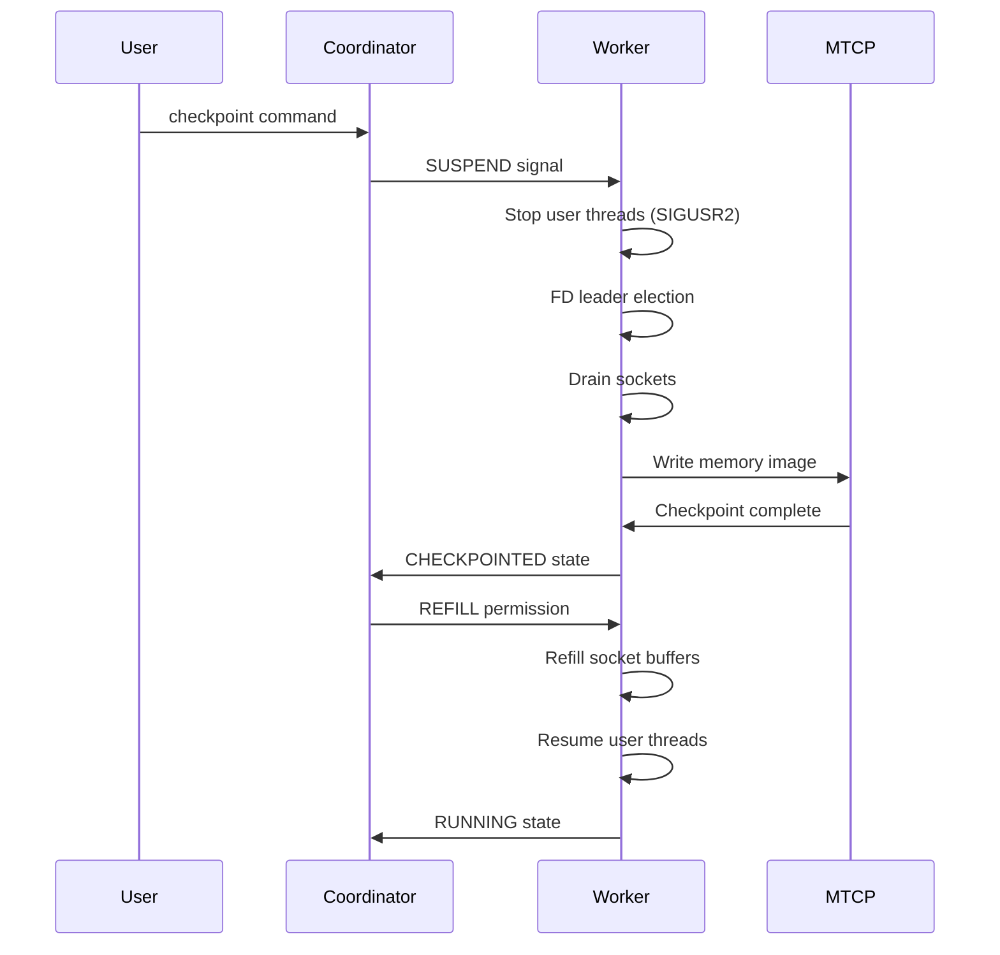
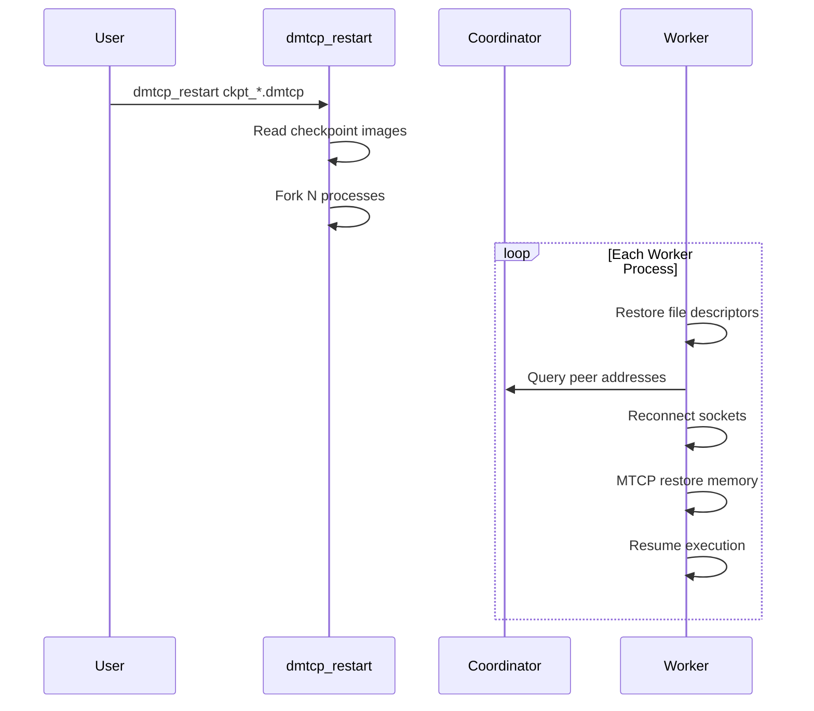

# DMTCP Architecture Overview

This document describes the high-level architecture of DMTCP, including the two-layer design, key components, and data flow patterns.

## Two-Layer Architecture

DMTCP employs a clean separation between distributed coordination and local checkpointing:

```
┌─────────────────────────────────────────────────────────────┐
│                    DMTCP Layer                              │
│  ┌─────────────────┐    ┌─────────────────┐                │
│  │   Coordinator   │◄──►│  Worker Process │                │
│  │   (dmtcp_coordinator) │  (libdmtcp.so)  │                │
│  └─────────────────┘    └─────────────────┘                │
│           │                           │                     │
│           │ TCP/IP (port 7779)        │ LD_PRELOAD          │
│           ▼                           ▼                     │
├─────────────────────────────────────────────────────────────┤
│                     MTCP Layer                              │
│  ┌─────────────────┐    ┌─────────────────┐                │
│  │  Memory Check-  │    │   Thread        │                │
│  │   point Writer  │    │  Management     │                │
│  └─────────────────┘    └─────────────────┘                │
└─────────────────────────────────────────────────────────────┘
```

### Layer 1: DMTCP (Distributed)

**Responsibilities:**
- Coordinator-based synchronization across processes
- Socket and file descriptor management
- Inter-process communication and coordination
- Plugin orchestration and event handling
- Virtual ID management (PIDs, TIDs, file descriptors)

**Key Components:**
- `dmtcp_coordinator.cpp` - Central coordinator process
- `coordinatorapi.cpp` - Client-coordinator communication protocol
- `connectionmanager.cpp` - Socket and FD lifecycle management
- `virtualpidtable.cpp` - PID/TID virtualization
- `plugin/` - Event handling and extension points

### Layer 2: MTCP (Multi-Threaded Checkpointing)

**Responsibilities:**
- Single-process memory checkpointing
- Thread quiescence and restoration
- Register and stack preservation
- Libc-independent operation during checkpoint

**Key Components:**
- `src/mtcp/mtcp_restart.c` - Memory restoration logic
- `src/mtcp/mtcp_util.c` - Low-level utilities
- `src/mtcp/mtcp_sys.h` - Raw syscall wrappers
- Thread descriptor management and TLS handling

## Core Components

### 1. Coordinator (`dmtcp_coordinator`)

The coordinator is a **stateless central authority** that:
- Manages checkpoint/restart commands
- Maintains global state across all workers
- Provides socket discovery service for restart
- Enforces the six-barrier checkpoint protocol

```cpp
// Key coordinator states
enum WorkerState {
  RUNNING,
  SUSPENDED,
  FD_LEADER_ELECTION,
  DRAINED,
  CHECKPOINTED,
  REFILLED
};
```

**Communication Protocol:**
- Default port: **7779**
- TCP/IP sockets for reliability
- Messages: checkpoint, restart, status, query
- Workers register on startup, heartbeat periodically

### 2. Worker Process (`libdmtcp.so`)

Each worker process runs with `libdmtcp.so` preloaded, providing:
- **Checkpoint thread**: Manages checkpoint/restart operations
- **Wrapper functions**: Intercept system calls for virtualization
- **Event handlers**: Respond to coordinator commands
- **Plugin integration**: Execute plugin callbacks

**Thread Architecture:**
```
┌─────────────────┐
│  User Thread 1  │ ← Application threads
├─────────────────┤
│  User Thread N  │
├─────────────────┤
│ Checkpoint Thread│ ← DMTCP management thread
└─────────────────┘
```

### 3. JALIB (DMTCP-Safe Utilities)

JALIB provides utilities that are safe to use during checkpoint phases:

| Component | Purpose | Key Files |
|-----------|---------|-----------|
| Memory Allocator | DMTCP-safe memory management | `jalib/jalloc.cpp` |
| Assertions | Logging and error handling | `jalib/jassert.cpp` |
| Sockets | Network communication | `jalib/jsocket.cpp` |
| Filesystem | File operations | `jalib/jfilesystem.cpp` |
| Serialization | Data persistence | `jalib/jserialize.cpp` |

**Why JALIB is needed:**
- Standard library calls can corrupt state during checkpoint
- Custom allocator avoids interference with application memory
- Specialized assertion handling for distributed debugging

## Data Flow Patterns

### Checkpoint Initiation Flow



### Restart Flow



## Virtualization System

### PID/TID Virtualization

DMTCP maintains **virtual PID/TID mappings** to preserve process identities:

```cpp
class VirtualPidTable {
  // Maps current (real) IDs to original (virtual) IDs
  map<pid_t, pid_t> realToVirtual;
  map<pid_t, pid_t> virtualToReal;
  
  pid_t getVirtualPid(pid_t realPid);
  pid_t getRealPid(pid_t virtualPid);
  bool isConflictingPid(pid_t pid);
};
```

**Conflict Resolution:**
- When new PID conflicts with existing virtual PID
- Terminate and recreate the process
- Ensures uniqueness of virtual IDs

### Connection Management

Each connection gets a **globally unique identifier**:

```cpp
struct ConnectionIdentifier {
  UniquePid conId;      // Globally unique process ID
  int id;               // Connection number within process
};
```

**Connection Types:**
- `TCP_CONNECTION` - Network sockets
- `PTY_CONNECTION` - Pseudo-terminals
- `FILE_CONNECTION` - Regular files
- `PIPE_CONNECTION` - Pipes (promoted to socketpairs)
- `FIFO_CONNECTION` - Named pipes
- `STDIO_CONNECTION` - Standard I/O

## Plugin Architecture

### Event Hook System

Plugins register for lifecycle events:

```cpp
DmtcpEventHook(DmtcpEvent_t event, DmtcpEventData_t *data) {
  switch (event) {
    case DMTCP_EVENT_PRECHECKPOINT:
      // Prepare for checkpoint
      break;
    case DMTCP_EVENT_CHECKPOINT:
      // Save plugin state
      break;
    case DMTCP_EVENT_RESUME:
    case DMTCP_EVENT_RESTART:
      // Restore after checkpoint/restart
      break;
  }
}
```

### Plugin Types

1. **Internal Plugins** (`src/plugin/`) - Core functionality
   - `alloc` - Memory allocation wrapping
   - `dl` - Dynamic linking interception
   - `ipc` - Inter-process communication

2. **External Plugins** (`plugin/`) - Optional extensions
   - `modify-env` - Environment variable modification
   - `pathvirt` - Path virtualization
   - `unique-ckpt` - Unique checkpoint naming

## Memory Layout

### Checkpoint Image Structure

```
┌─────────────────────────────────────┐
│           Header                     │
│  - Magic number                      │
│  - Version info                      │
│  - Architecture                      │
├─────────────────────────────────────┤
│         Process Metadata             │
│  - PID/TID mappings                  │
│  - File descriptor table             │
│  - Connection information            │
├─────────────────────────────────────┤
│         Memory Segments              │
│  - Code segments                     │
│  - Data segments                     │
│  - Heap                              │
│  - Stacks (one per thread)           │
├─────────────────────────────────────┤
│         Plugin Data                  │
│  - Plugin-specific state             │
└─────────────────────────────────────┘
```

### Thread Restoration

Each thread's state includes:
- **Registers**: General purpose registers, program counter
- **Stack**: Stack pointer and content
- **TLS**: Thread-local storage segment
- **Signal mask**: Blocked signals

## Key Design Decisions

### 1. User-Space Operation
- **Pros**: No kernel modifications, portable across systems
- **Cons**: Must handle race conditions carefully
- **Solution**: Six-barrier protocol with coordinator synchronization

### 2. LD_PRELOAD Mechanism
- **Pros**: Transparent to applications, no source changes
- **Cons**: Doesn't work with statically linked binaries
- **Solution**: Support for `dmtcp_nocheckpoint.c` for special cases

### 3. Libc Independence During Checkpoint
- **Pros**: Avoids corruption of application state
- **Cons**: Requires custom syscall wrappers
- **Solution**: JALIB utilities and raw syscalls in MTCP

### 4. Stateless Coordinator
- **Pros**: Simple, supports coordinator migration
- **Cons**: Workers must maintain some state
- **Solution**: Workers checkpoint coordinator connection info

## Performance Characteristics

### Checkpoint Time Complexity
- **O(N)** in number of memory segments
- **O(M)** in number of connections
- **O(T)** in number of threads

### Memory Overhead
- **JALIB**: ~1MB for custom allocator
- **Connection tables**: ~100 bytes per connection
- **PID/TID tables**: ~50 bytes per process/thread

### Network Overhead
- **Coordinator messages**: ~1KB per checkpoint
- **Socket draining**: Variable based on buffer content
- **Discovery queries**: ~100 bytes per socket on restart

## Related Systems

### MANA (MPI-Agnostic Network-Agnostic)
- Extends DMTCP for MPI applications
- Split-process model: application vs MPI library
- Supports checkpoint under MPICH, restart under Open MPI

### CRAC (Checkpoint-Restart Architecture for CUDA)
- GPU checkpointing extension
- CUDA API call logging and replay
- Supports CUDA Streams and UVM

## Further Reading

- **Technical Papers**: See architecture documentation for full list
- **Plugin Tutorial**: `doc/plugin-tutorial.pdf`
- **Debugging Guide**: `doc/debugging-dmtcp.txt`
- **Implementation Details**: Various `doc/*.txt` files

---

This architecture provides the foundation for understanding DMTCP's implementation details and extending its functionality through plugins and contributions.