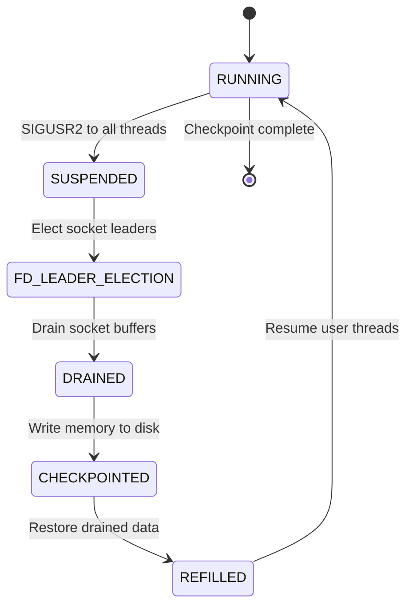
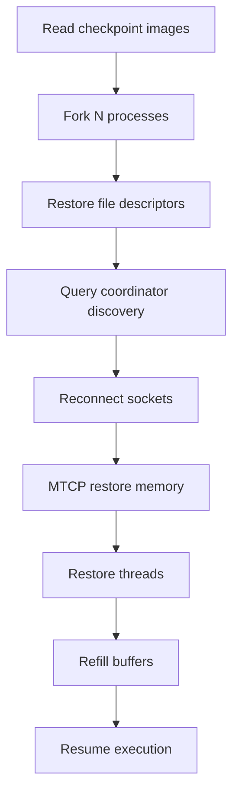

# DMTCP Checkpoint-Restart Flow

This document details the complete checkpoint and restart process in DMTCP, including the six-barrier protocol, state transitions, and data flow patterns.

## Overview

DMTCP uses a **coordinated six-barrier protocol** to ensure consistency across all processes in a computation. The coordinator acts as a central authority, managing state transitions and preventing race conditions.

## Checkpoint Process

### Initiation Methods

A checkpoint can be initiated in several ways:

1. **Console Command**: Type 'c' in `dmtcp_coordinator` console
2. **Command Line**: `dmtcp_command --checkpoint`
3. **Programmatic API**: `dmtcp_checkpoint()` from application code
4. **Periodic Timer**: `dmtcp_launch --interval <seconds>`
5. **Plugin Request**: Via `dmtcp_send_coordinator_command()`

### Six-Barrier Protocol



### Stage 1: RUNNING → SUSPENDED

**Purpose**: Quiesce all user threads to prevent state changes during checkpoint.

**Implementation**:
```cpp
// In dmtcp_coordinator.cpp
void DmtcpCoordinator::startCheckpoint() {
  broadcastMessage(DMT_SUSPEND_MESSAGE);
  waitForAllWorkers(WorkerState::SUSPENDED);
}

// In worker process
void suspendUserThreads() {
  // Send SIGUSR2 to all user threads
  for (each thread) {
    pthread_kill(thread_id, SIGUSR2);
  }
  
  // Wait for threads to enter signal handler
  waitForThreadsStopped();
}
```

**Signal Handler Flow**:
```cpp
// In threadlist.cpp
void stopthisthread(int signum) {
  // Save thread context (registers, stack)
  sigsetjmp(thread_context);
  
  // Block in semaphore until checkpoint complete
  sem_wait(&checkpoint_sem);
  
  // Will be released during resume phase
}
```

**Critical Invariant**: Either DMTCP checkpoint thread OR user threads are active, never both simultaneously.

### Stage 2: FD_LEADER_ELECTION

**Purpose**: For each shared file descriptor, elect a leader process to manage draining.

**Algorithm**:
```cpp
// In connectionmanager.cpp
void electFdLeaders() {
  for (each shared fd) {
    // All processes try to become leader
    fcntl(fd, F_SETOWN, getpid());
    
    // Last process to set ownership wins
    if (fcntl(fd, F_GETOWN) == getpid()) {
      markAsLeader(fd);
    }
  }
}
```

**Leader Election Rules**:
- Uses kernel's `F_SETOWN` flag via `fcntl()`
- All processes set ownership simultaneously
- The last process to set ownership becomes the leader
- Leader coordinates draining for that connection

### Stage 3: DRAINED

**Purpose**: Flush network buffers and establish globally unique connection IDs.

**Socket Draining Protocol**:
```cpp
// In socketwrappers.cpp
void drainSockets() {
  for (each leader socket) {
    // Send special token to peer
    sendDrainToken(socket);
    
    // Receive until token appears
    while (!receivedDrainToken(socket)) {
      receiveData(socket);
    }
  }
  
  // Establish globally unique IDs
  establishConnectionIds();
}
```

**Connection ID Establishment**:
```cpp
struct ConnectionIdentifier {
  UniquePid processId;  // Globally unique process identifier
  int connectionNumber; // Sequential number within process
};

// Handshake to establish unique IDs
void handshakeConnectionIds() {
  for (each socket) {
    sendConnectionId(socket, local_id);
    remote_id = receiveConnectionId(socket);
    storePeerMapping(local_id, remote_id);
  }
}
```

### Stage 4: CHECKPOINTED

**Purpose**: Write process memory and state to checkpoint image files.

**Memory Checkpointing** (MTCP layer):
```c
// In mtcp_restart.c
void writeCheckpointImage() {
  // Read /proc/self/maps to enumerate memory segments
  FILE *maps = fopen("/proc/self/maps", "r");
  while (fgets(line, sizeof(line), maps)) {
    parseMemorySegment(line, &segment);
    
    // Write segment header
    writeSegmentHeader(segment);
    
    // Write segment data
    writeSegmentData(segment.start, segment.size);
  }
  
  // Write thread information
  writeThreadStates();
  
  // Write plugin data
  writePluginData();
}
```

**Checkpoint Image Structure**:
```
/tmp/ckpt_<progname>_<pid>_<timestamp>.dmtcp
├── Header (magic, version, arch)
├── Process metadata (PID, TID mappings)
├── Memory segments (code, data, heap, stacks)
├── File descriptor table
├── Connection information
└── Plugin-specific data
```

**Compression** (optional):
```cpp
// In ckptserializer.cpp
void writeCompressedData(void *data, size_t size) {
  if (enable_compression) {
    // Use gzip compression
    gzwrite(compressed_fd, data, size);
  } else {
    write(checkpoint_fd, data, size);
  }
}
```

### Stage 5: REFILLED

**Purpose**: Restore drained socket buffer data for retransmission on resume.

**Refill Protocol**:
```cpp
// In socketwrappers.cpp
void refillSockets() {
  for (each drained socket) {
    // Send drained data back to original sender
    for (each drained_packet) {
      sendToPeer(socket, drained_packet);
    }
  }
}
```

**Data Flow**:
```
Original Sender → Leader (drained) → Refill → Original Sender
                                    ↓
                              Receiver (resumes)
```

### Stage 6: RUNNING

**Purpose**: Resume user thread execution.

**Thread Resume**:
```cpp
// In threadlist.cpp
void resumeUserThreads() {
  // Release all threads from semaphore
  for (each thread) {
    sem_post(&checkpoint_sem);
  }
  
  // Wait for threads to acknowledge resume
  waitForThreadsResumed();
}

// Signal handler continuation
void stopthisthread(int signum) {
  // ... (suspension code)
  
  sem_wait(&checkpoint_sem);  // Blocked here
  
  // Released - resume execution
  siglongjmp(thread_context, 1);
}
```

## Restart Process

### Initiation

```bash
# Basic restart
dmtcp_restart ckpt_progname_*.dmtcp

# With new coordinator
dmtcp_restart --coord-host newhost ckpt_*.dmtcp

# With plugins
dmtcp_restart --with-plugin plugin.so ckpt_*.dmtcp
```

### Restart Algorithm



### Step 1: Read Checkpoint Images

```cpp
// In dmtcp_restart.cpp
int main(int argc, char **argv) {
  // Read all checkpoint files
  for (each ckpt_file) {
    CheckpointImage *image = readCheckpointFile(ckpt_file);
    images.push_back(image);
  }
  
  // Validate compatibility
  validateCheckpointCompatibility(images);
  
  // Start restart process
  restartFromImages(images);
}
```

### Step 2: Process Forking

```cpp
// In dmtcp_restart.cpp
void forkRestartProcesses(vector<CheckpointImage*> images) {
  int num_processes = images.size();
  
  for (int i = 0; i < num_processes; i++) {
    pid_t pid = fork();
    
    if (pid == 0) {
      // Child process - restore this image
      restoreProcess(images[i]);
      exit(0);  // Should not reach here
    } else {
      // Parent - continue forking
      child_pids.push_back(pid);
    }
  }
}
```

### Step 3: File Descriptor Restoration

```cpp
// In connectionmanager.cpp
void restoreFileDescriptors(CheckpointImage *image) {
  // Restore in dependency order
  restoreFiles();           // Regular files first
  restoreListenSockets();   // Listen sockets next
  restorePseudoTerminals(); // PTYs
  restorePipes();           // Pipes and FIFOs
  
  // Restore file descriptor positions
  rearrangeFileDescriptors();
}

void rearrangeFileDescriptors() {
  for (each fd_mapping) {
    if (original_fd != current_fd) {
      dup2(current_fd, original_fd);
      close(current_fd);
    }
  }
}
```

### Step 4: Socket Reconnection

**Discovery Service Query**:
```cpp
// In socketwrappers.cpp
void reconnectSockets() {
  for (each socket_connection) {
    // Query coordinator for peer's new address
    PeerInfo peer = coordinator->queryPeer(connection_id);
    
    // Reconnect to peer
    int new_socket = socket(peer.family, peer.type, 0);
    connect(new_socket, peer.address, peer.addrlen);
    
    // Replace old socket
    dup2(new_socket, original_fd);
    close(new_socket);
  }
}
```

**Migration Support**:
- Processes can restart on different hosts
- Coordinator discovery service provides new peer addresses
- Globally unique connection IDs enable reconnection

### Step 5: Memory Restoration (MTCP)

```c
// In mtcp_restart.c
void restoreMemory(CheckpointImage *image) {
  // Restore primary thread stack
  restorePrimaryStack();
  
  // Set up TLS for primary thread
  setupThreadLocalStorage();
  
  // Restore memory segments
  for (each segment) {
    mmap(segment.addr, segment.size, 
         segment.prot, segment.flags, 
         segment.fd, segment.offset);
    
    // Copy segment data
    memcpy(segment.addr, segment.data, segment.size);
  }
  
  // Restore other threads
  restoreAllThreads();
}
```

### Step 6: Thread Recreation

```c
// In threadinfo.c
void restoreAllThreads() {
  // Primary thread already running
  pid_t motherpid = gettid();
  
  // Recreate secondary threads
  for (each thread_info) {
    if (thread_info->tid != motherpid) {
      recreateThread(thread_info);
    }
  }
}

void recreateThread(ThreadInfo *thread_info) {
  // Create new thread with same TLS
  pid_t new_tid = clone(thread_restorer,
                       thread_info->stack,
                       CLONE_VM | CLONE_FS | CLONE_FILES | CLONE_SIGHAND |
                       CLONE_THREAD | CLONE_SYSVSEM | CLONE_PARENT_SETTID |
                       CLONE_CHILD_CLEARTID,
                       thread_info);
  
  // Set thread ID in TCB
  patchThreadControlBlock(new_tid, thread_info->original_tid);
  
  // Restore thread context
  setThreadContext(new_tid, thread_info->context);
}
```

### Step 7: Buffer Refill and Resume

```cpp
// In socketwrappers.cpp
void refillAndResume() {
  // Refill drained network data
  refillDrainedBuffers();
  
  // Resume all user threads
  resumeUserThreads();
  
  // Signal coordinator that restart is complete
  coordinator->sendRestartComplete();
}
```

## State Management

### Coordinator State Tracking

```cpp
// In dmtcp_coordinator.cpp
class DmtcpCoordinator {
  map<UniquePid, WorkerState> workerStates;
  WorkerState minimumState;
  WorkerState maximumState;
  
  void updateWorkerState(UniquePid worker, WorkerState newState) {
    workerStates[worker] = newState;
    recalculateMinMaxStates();
    
    // Release barriers if all workers at same state
    if (minimumState == maximumState) {
      releaseNextBarrier();
    }
  }
};
```

### Worker State Machine

```cpp
// In dmtcpworker.cpp
enum WorkerState {
  RUNNING = 0,
  SUSPENDED = 1,
  FD_LEADER_ELECTION = 2,
  DRAINED = 3,
  CHECKPOINTED = 4,
  REFILLED = 5
};

void transitionToState(WorkerState newState) {
  currentState = newState;
  coordinator->sendStateUpdate(newState);
  
  // Wait for coordinator permission to proceed
  coordinator->waitForBarrierRelease();
}
```

## Error Handling

### Checkpoint Failures

```cpp
// Common failure scenarios
void handleCheckpointFailure() {
  switch (failure_type) {
    case THREAD_SUSPEND_ERROR:
      // Force kill stubborn threads
      killUnresponsiveThreads();
      break;
      
    case SOCKET_DRAIN_ERROR:
      // Mark socket as dead, continue without it
      markSocketDead(problematic_socket);
      break;
      
    case DISK_FULL_ERROR:
      // Abort checkpoint, notify user
      coordinator->broadcastError("Disk full during checkpoint");
      break;
  }
}
```

### Restart Failures

```cpp
// Restart recovery strategies
void handleRestartFailure() {
  if (port_in_use) {
    // Try alternative ports
    coordinator->startOnAlternativePort();
  } else if (peer_not_found) {
    // Wait for peer to restart
    sleep(1);
    retryReconnection();
  } else if (memory_restore_error) {
    // Fatal error - cannot recover
    exit(1);
  }
}
```

## Performance Considerations

### Checkpoint Time Factors

1. **Memory Size**: O(total_memory)
2. **Number of Threads**: O(num_threads)
3. **Number of Connections**: O(connections × buffer_size)
4. **Disk Speed**: I/O bound for large memory
5. **Network Latency**: For distributed draining

### Optimization Strategies

```cpp
// Incremental checkpointing (future work)
void incrementalCheckpoint() {
  // Track dirty pages since last checkpoint
  vector<MemoryPage> dirtyPages = findDirtyPages();
  
  // Only checkpoint dirty pages
  for (each dirty_page) {
    writePageToCheckpoint(dirty_page);
  }
}

// Parallel checkpointing (future work)
void parallelCheckpoint() {
  // Divide memory among threads
  for (each checkpoint_thread) {
    thread->checkpointMemoryRegion(assigned_region);
  }
}
```

## Debugging the Flow

### Logging Checkpoints

```bash
# Enable detailed logging
./configure --enable-logging
make clean && make

# View checkpoint logs
tail -f /tmp/dmtcp-$USER@$(hostname)/jassertlog.*
```

### GDB Debugging

```bash
# Debug checkpoint initiation
gdb --args dmtcp_launch test/dmtcp1
(gdb) break DmtcpWorker::suspendUserThreads
(gdb) run

# Debug restart
DMTCP_RESTART_PAUSE=3 dmtcp_restart ckpt_*.dmtcp &
gdb -p $(pgrep -n dmtcp_restart)
(gdb) source util/gdb-dmtcp-utils.py
```

### Common Issues

1. **Deadlock in SUSPENDED state**
   - Check for threads blocking in syscalls
   - Verify signal handler installation

2. **Socket drain timeout**
   - Network connectivity issues
   - Peer process crashed

3. **Memory restoration failure**
   - Architecture mismatch
   - Insufficient memory on restart host

---

This six-barrier protocol ensures consistent checkpointing across distributed processes while maintaining performance and reliability. Understanding this flow is essential for extending DMTCP and troubleshooting issues.