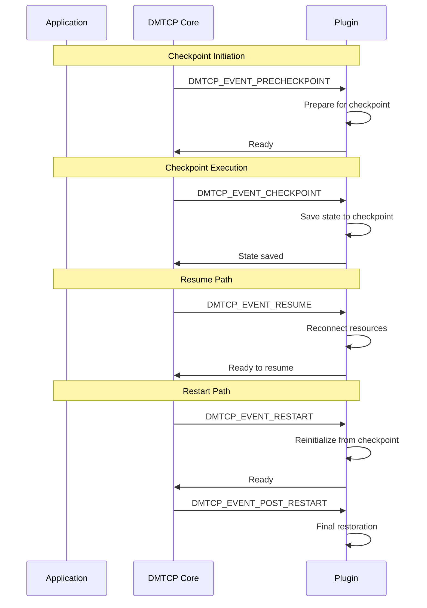

# DMTCP Plugin Development Guide

This guide covers developing plugins for DMTCP, including event handling, system call wrapping, and inter-plugin communication.

## Plugin Architecture Overview

DMTCP plugins extend functionality through three main mechanisms:

1. **Event Hooks** - Respond to checkpoint/restart lifecycle events
2. **System Call Wrappers** - Intercept and virtualize system calls
3. **Key-Value Database** - Inter-plugin communication via coordinator

## Plugin Types

### Internal Plugins (`src/plugin/`)
Core functionality plugins that are always loaded:
- `alloc` - Memory allocation wrapping
- `dl` - Dynamic linking interception
- `ipc` - Inter-process communication

### External Plugins (`plugin/`)
Optional extensions loaded on demand:
- `modify-env` - Environment variable modification
- `pathvirt` - Path virtualization
- `unique-ckpt` - Unique checkpoint naming

## Getting Started

### Minimal Plugin Structure

```cpp
// myplugin.cpp
#include <dmtcp/plugin.h>

static void myplugin_event_hook(DmtcpEvent_t event, DmtcpEventData_t *data) {
  switch (event) {
    case DMTCP_EVENT_PRECHECKPOINT:
      // Prepare for checkpoint
      break;
    case DMTCP_EVENT_CHECKPOINT:
      // Save plugin state
      break;
    case DMTCP_EVENT_RESUME:
      // Resume after checkpoint
      break;
    case DMTCP_EVENT_RESTART:
      // Restart from checkpoint
      break;
    default:
      break;
  }
}

DmtcpPluginDescriptor_t myplugin_plugin = {
  DMTCP_PLUGIN_API_VERSION,
  "MyPlugin",
  "1.0.0",
  "My Name",
  "my@email.com",
  "My custom DMTCP plugin",
  myplugin_event_hook
};

DMTCP_DECL_PLUGIN(myplugin_plugin);
```

### Build System Integration

```makefile
# Makefile.am for plugin
lib_LTLIBRARIES = libmyplugin.la

libmyplugin_la_SOURCES = myplugin.cpp
libmyplugin_la_CPPFLAGS = $(DMTCP_INCLUDES)
libmyplugin_la_LDFLAGS = -avoid-version -module
```

## Event System

### Event Types and Timing

```cpp
typedef enum {
  DMTCP_EVENT_INIT,           // Plugin initialization
  DMTCP_EVENT_EXIT,           // Plugin cleanup
  DMTCP_EVENT_PRECHECKPOINT,  // Before checkpoint begins
  DMTCP_EVENT_CHECKPOINT,     // During checkpoint
  DMTCP_EVENT_RESUME,         // After checkpoint, before resume
  DMTCP_EVENT_RESTART,        // On restart
  DMTCP_EVENT_POST_RESTART,   // After restart completes
  DMTCP_EVENT_THREAD_START,   // New thread created
  DMTCP_EVENT_THREAD_EXIT,    // Thread exiting
  DMTCP_EVENT_REFILL,         // During buffer refill
  DMTCP_EVENT_WRITE_CKPT,     // Writing checkpoint data
  DMTCP_EVENT_READ_CKPT,      // Reading checkpoint data
  DMTCP_EVENT_REGISTER_FD,    // New file descriptor
  DMTCP_EVENT_UNREGISTER_FD,  // File descriptor closed
  DMTCP_EVENT_DRAIN_FD,       // Drain file descriptor
  DMTCP_EVENT_REFILL_FD,      // Refill file descriptor
  DMTCP_EVENT_QUIESCE,        // Quiesce resources
  DMTCP_EVENT_RESTART_THREAD, // Restart specific thread
  DMTCP_EVENT_PRE_EXEC,       // Before exec()
  DMTCP_EVENT_POST_EXEC,      // After exec()
  DMTCP_EVENT_ATFORK_PREPARE, // Before fork()
  DMTCP_EVENT_ATFORK_PARENT,  // In parent after fork()
  DMTCP_EVENT_ATFORK_CHILD    // In child after fork()
} DmtcpEvent_t;
```

### Event Execution Order



### Event Data Structures

```cpp
typedef struct {
  // Generic event data
  void *plugin_data;
  
  // Event-specific data
  union {
    struct {
      int fd;
      int flags;
    } fd_info;
    
    struct {
      pthread_t thread_id;
      void *thread_arg;
    } thread_info;
    
    struct {
      const char *filename;
      int fd;
      int flags;
      mode_t mode;
    } file_info;
  } event_data;
} DmtcpEventData_t;
```

## System Call Wrapping

### Wrapper Function Pattern

```cpp
// Wrap open() system call
extern "C" int open(const char *pathname, int flags, ...) {
  // Get original open function
  static int (*real_open) (const char *, int, mode_t) = NULL;
  if (real_open == NULL) {
    real_open = (int (*)(const char *, int, mode_t)) dmtcp_dlsym(RTLD_NEXT, "open");
  }
  
  // Pre-processing
  pathname = myplugin_translate_path(pathname);
  
  // Call original function
  mode_t mode = 0;
  if (flags & O_CREAT) {
    va_list args;
    va_start(args, flags);
    mode = va_arg(args, mode_t);
    va_end(args);
  }
  
  int result = real_open(pathname, flags, mode);
  
  // Post-processing
  if (result >= 0) {
    myplugin_track_fd(result, pathname);
  }
  
  return result;
}
```

### Wrapper Registration

```cpp
// In plugin initialization
static void myplugin_init() {
  // Register wrapper functions
  dmtcp_wrap_function("open", myplugin_open);
  dmtcp_wrap_function("close", myplugin_close);
  dmtcp_wrap_function("read", myplugin_read);
  dmtcp_wrap_function("write", myplugin_write);
}
```

### Common Wrapped Functions

| Category | Functions | Purpose |
|----------|-----------|---------|
| Process | `fork`, `exec`, `getpid`, `gettid` | Process virtualization |
| Files | `open`, `close`, `read`, `write`, `lseek` | File I/O tracking |
| Sockets | `socket`, `connect`, `bind`, `listen`, `accept` | Network virtualization |
| Memory | `mmap`, `munmap`, `brk`, `mremap` | Memory management |
| Signals | `signal`, `sigaction`, `sigprocmask` | Signal handling |

## Inter-Plugin Communication

### Key-Value Database

```cpp
// Store data in coordinator database
void myplugin_store_data(const char *key, const char *value) {
  dmtcp_send_key_val_pair_to_coordinator(key, value);
}

// Retrieve data from coordinator database
char *myplugin_retrieve_data(const char *key) {
  return dmtcp_get_coordinator_key_val(key);
}

// Example: Share socket information between plugins
void share_socket_info(int fd, const char *type) {
  char key[256];
  char value[256];
  
  snprintf(key, sizeof(key), "socket_%d_type", fd);
  snprintf(value, sizeof(value), "%s", type);
  
  dmtcp_send_key_val_pair_to_coordinator(key, value);
}
```

### Plugin Discovery

```cpp
// Check if another plugin is loaded
bool is_plugin_loaded(const char *plugin_name) {
  return dmtcp_is_plugin_loaded(plugin_name);
}

// Get data from specific plugin
char *get_plugin_data(const char *plugin_name, const char *key) {
  char full_key[256];
  snprintf(full_key, sizeof(full_key), "%s_%s", plugin_name, key);
  return dmtcp_get_coordinator_key_val(full_key);
}
```

## Plugin Examples

### Example 1: File Access Logger

```cpp
// filelogger.cpp
#include <dmtcp/plugin.h>
#include <fstream>
#include <map>

static std::map<int, std::string> fd_to_filename;
static std::ofstream log_file;

static void filelogger_event_hook(DmtcpEvent_t event, DmtcpEventData_t *data) {
  switch (event) {
    case DMTCP_EVENT_INIT:
      log_file.open("/tmp/dmtcp_file_access.log");
      break;
      
    case DMTCP_EVENT_REGISTER_FD:
      if (data->event_data.fd_info.flags & O_CREAT) {
        fd_to_filename[data->event_data.fd_info.fd] = 
          std::string(data->event_data.file_info.filename);
        log_file << "CREATED: " << data->event_data.file_info.filename 
                 << " (fd=" << data->event_data.fd_info.fd << ")" << std::endl;
      }
      break;
      
    case DMTCP_EVENT_UNREGISTER_FD:
      if (fd_to_filename.count(data->event_data.fd_info.fd)) {
        log_file << "CLOSED: " << fd_to_filename[data->event_data.fd_info.fd]
                 << " (fd=" << data->event_data.fd_info.fd << ")" << std::endl;
        fd_to_filename.erase(data->event_data.fd_info.fd);
      }
      break;
      
    case DMTCP_EVENT_EXIT:
      log_file.close();
      break;
      
    default:
      break;
  }
}

extern "C" int open(const char *pathname, int flags, ...) {
  static int (*real_open) (const char *, int, mode_t) = NULL;
  if (real_open == NULL) {
    real_open = (int (*)(const char *, int, mode_t)) dmtcp_dlsym(RTLD_NEXT, "open");
  }
  
  mode_t mode = 0;
  if (flags & O_CREAT) {
    va_list args;
    va_start(args, flags);
    mode = va_arg(args, mode_t);
    va_end(args);
  }
  
  int result = real_open(pathname, flags, mode);
  
  if (result >= 0) {
    log_file << "OPENED: " << pathname << " (fd=" << result << ")" << std::endl;
  }
  
  return result;
}

DmtcpPluginDescriptor_t filelogger_plugin = {
  DMTCP_PLUGIN_API_VERSION,
  "FileLogger",
  "1.0.0",
  "DMTCP Team",
  "dmtcp@ccs.neu.edu",
  "Logs file access operations",
  filelogger_event_hook
};

DMTCP_DECL_PLUGIN(filelogger_plugin);
```

### Example 2: Network Bandwidth Monitor

```cpp
// netmonitor.cpp
#include <dmtcp/plugin.h>
#include <sys/time.h>

static struct {
  unsigned long bytes_sent;
  unsigned long bytes_received;
  struct timeval last_checkpoint;
} network_stats;

static void netmonitor_event_hook(DmtcpEvent_t event, DmtcpEventData_t *data) {
  switch (event) {
    case DMTCP_EVENT_PRECHECKPOINT:
      gettimeofday(&network_stats.last_checkpoint, NULL);
      break;
      
    case DMTCP_EVENT_RESUME:
      {
        struct timeval now;
        gettimeofday(&now, NULL);
        double elapsed = (now.tv_sec - network_stats.last_checkpoint.tv_sec) +
                         (now.tv_usec - network_stats.last_checkpoint.tv_usec) / 1000000.0;
        
        printf("Network stats since last checkpoint:\n");
        printf("  Sent: %lu bytes (%.2f KB/s)\n", 
               network_stats.bytes_sent, network_stats.bytes_sent / elapsed / 1024);
        printf("  Received: %lu bytes (%.2f KB/s)\n",
               network_stats.bytes_received, network_stats.bytes_received / elapsed / 1024);
        
        // Reset counters
        network_stats.bytes_sent = 0;
        network_stats.bytes_received = 0;
      }
      break;
      
    default:
      break;
  }
}

extern "C" ssize_t send(int sockfd, const void *buf, size_t len, int flags) {
  static ssize_t (*real_send) (int, const void *, size_t, int) = NULL;
  if (real_send == NULL) {
    real_send = (ssize_t (*)(int, const void *, size_t, int)) dmtcp_dlsym(RTLD_NEXT, "send");
  }
  
  ssize_t result = real_send(sockfd, buf, len, flags);
  
  if (result > 0) {
    network_stats.bytes_sent += result;
  }
  
  return result;
}

extern "C" ssize_t recv(int sockfd, void *buf, size_t len, int flags) {
  static ssize_t (*real_recv) (int, void *, size_t, int) = NULL;
  if (real_recv == NULL) {
    real_recv = (ssize_t (*)(int, void *, size_t, int)) dmtcp_dlsym(RTLD_NEXT, "recv");
  }
  
  ssize_t result = real_recv(sockfd, buf, len, flags);
  
  if (result > 0) {
    network_stats.bytes_received += result;
  }
  
  return result;
}

DmtcpPluginDescriptor_t netmonitor_plugin = {
  DMTCP_PLUGIN_API_VERSION,
  "NetMonitor",
  "1.0.0",
  "DMTCP Team",
  "dmtcp@ccs.neu.edu",
  "Monitors network bandwidth usage",
  netmonitor_event_hook
};

DMTCP_DECL_PLUGIN(netmonitor_plugin);
```

## Plugin Loading and Configuration

### Command Line Loading

```bash
# Load single plugin
dmtcp_launch --with-plugin ./libmyplugin.so myapp

# Load multiple plugins
dmtcp_launch --with-plugin ./libplugin1.so --with-plugin ./libplugin2.so myapp

# Load plugin with environment variable
DMTCP_PLUGIN=./libmyplugin.so dmtcp_launch myapp
```

### Plugin Configuration

```cpp
// Configuration handling
static void myplugin_load_config() {
  const char *config_file = getenv("MYPLUGIN_CONFIG");
  if (config_file) {
    // Parse configuration file
    parse_config_file(config_file);
  }
  
  // Environment variable configuration
  const char *debug_level = getenv("MYPLUGIN_DEBUG");
  if (debug_level) {
    myplugin_debug_level = atoi(debug_level);
  }
}

// In event hook
static void myplugin_event_hook(DmtcpEvent_t event, DmtcpEventData_t *data) {
  switch (event) {
    case DMTCP_EVENT_INIT:
      myplugin_load_config();
      break;
    // ... other events
  }
}
```

## Testing Plugins

### Unit Testing

```cpp
// test_myplugin.cpp
#include <gtest/gtest.h>
#include <dmtcp/plugin.h>

class MyPluginTest : public ::testing::Test {
protected:
  void SetUp() override {
    // Initialize plugin for testing
    myplugin_event_hook(DMTCP_EVENT_INIT, NULL);
  }
  
  void TearDown() override {
    // Cleanup plugin
    myplugin_event_hook(DMTCP_EVENT_EXIT, NULL);
  }
};

TEST_F(MyPluginTest, BasicFunctionality) {
  // Test plugin functionality
  EXPECT_TRUE(myplugin_test_function());
}

TEST_F(MyPluginTest, CheckpointResume) {
  // Test checkpoint/resume behavior
  myplugin_event_hook(DMTCP_EVENT_PRECHECKPOINT, NULL);
  myplugin_event_hook(DMTCP_EVENT_CHECKPOINT, NULL);
  myplugin_event_hook(DMTCP_EVENT_RESUME, NULL);
  
  // Verify state
  EXPECT_TRUE(myplugin_state_consistent());
}
```

### Integration Testing

```bash
# Test with simple application
dmtcp_launch --with-plugin ./libmyplugin.so test/dmtcp1
dmtcp_command --checkpoint
dmtcp_restart ckpt_dmtcp1_*.dmtcp

# Test with multi-process application
dmtcp_launch --with-plugin ./libmyplugin.so test/client-server &
dmtcp_command --checkpoint
dmtcp_restart ckpt_*_*.dmtcp
```

## Best Practices

### Performance Considerations

1. **Minimize wrapper overhead**
   ```cpp
   // Cache function pointers
   static int (*real_open) (const char *, int, mode_t) = NULL;
   if (real_open == NULL) {
     real_open = (int (*)(const char *, int, mode_t)) dmtcp_dlsym(RTLD_NEXT, "open");
   }
   ```

2. **Avoid expensive operations in wrappers**
   ```cpp
   // Bad: Expensive logging in every call
   extern "C" int read(int fd, void *buf, size_t count) {
     log_file << "Read called on fd " << fd << std::endl;  // Expensive!
     return real_read(fd, buf, count);
   }
   
   // Good: Conditional logging
   extern "C" int read(int fd, void *buf, size_t count) {
     if (debug_enabled) {
       log_file << "Read called on fd " << fd << std::endl;
     }
     return real_read(fd, buf, count);
   }
   ```

3. **Use efficient data structures**
   ```cpp
   // Good: Use unordered_map for O(1) lookups
   static std::unordered_map<int, std::string> fd_to_path;
   
   // Bad: Use map for O(log n) lookups
   static std::map<int, std::string> fd_to_path;
   ```

### Thread Safety

```cpp
// Use thread-safe data structures
#include <mutex>

static std::mutex plugin_mutex;
static std::map<int, std::string> shared_data;

extern "C" int open(const char *pathname, int flags, ...) {
  std::lock_guard<std::mutex> lock(plugin_mutex);
  
  // Thread-safe operations
  int fd = real_open(pathname, flags, mode);
  if (fd >= 0) {
    shared_data[fd] = pathname;
  }
  
  return fd;
}
```

### Error Handling

```cpp
// Robust error handling in wrappers
extern "C" int socket(int domain, int type, int protocol) {
  int result = real_socket(domain, type, protocol);
  
  if (result == -1) {
    // Handle error case
    if (errno == EMFILE) {
      // Too many files open
      myplugin_cleanup_old_fds();
    }
    return result;
  }
  
  // Handle success case
  myplugin_track_socket(result, domain, type);
  return result;
}
```

## Debugging Plugins

### Plugin Logging

```cpp
// Use DMTCP logging facilities
static void myplugin_event_hook(DmtCPEvent_t event, DmtcpEventData_t *data) {
  switch (event) {
    case DMTCP_EVENT_PRECHECKPOINT:
      JTRACE("MyPlugin: Pre-checkpoint") (getpid());
      break;
    case DMTCP_EVENT_CHECKPOINT:
      JNOTE("MyPlugin: Checkpointing state");
      break;
    // ... other events
  }
}
```

### GDB Debugging

```bash
# Debug plugin initialization
gdb --args dmtcp_launch --with-plugin ./libmyplugin.so myapp
(gdb) break myplugin_event_hook
(gdb) run

# Debug plugin during checkpoint
DMTCP_RESTART_PAUSE=2 dmtcp_restart ckpt_*.dmtcp &
gdb -p $(pgrep -n myapp)
(gdb) break myplugin_function
```

## Advanced Topics

### Plugin Dependencies

```cpp
// Declare plugin dependencies
DmtcpPluginDescriptor_t myplugin_plugin = {
  DMTCP_PLUGIN_API_VERSION,
  "MyPlugin",
  "1.0.0",
  "Author",
  "email",
  "Description",
  myplugin_event_hook,
  NULL,  // No special initialization
  NULL,  // No special cleanup
  "PathVirt,FileLogger"  // Depends on these plugins
};
```

### Dynamic Plugin Loading

```cpp
// Load plugin at runtime
void load_plugin_dynamically(const char *plugin_path) {
  void *handle = dlopen(plugin_path, RTLD_LAZY);
  if (!handle) {
    JERROR("Failed to load plugin") (plugin_path, dlerror());
    return;
  }
  
  // Get plugin descriptor
  DmtcpPluginDescriptor_t *(*get_plugin)() = 
    (DmtcpPluginDescriptor_t *(*)()) dlsym(handle, "get_plugin_descriptor");
  
  if (get_plugin) {
    DmtcpPluginDescriptor_t *plugin = get_plugin();
    dmtcp_register_plugin(plugin);
  }
}
```

---

This guide provides the foundation for developing robust DMTCP plugins. For more examples, see the `test/plugin/` directory and the comprehensive tutorial in `doc/plugin-tutorial.pdf`.