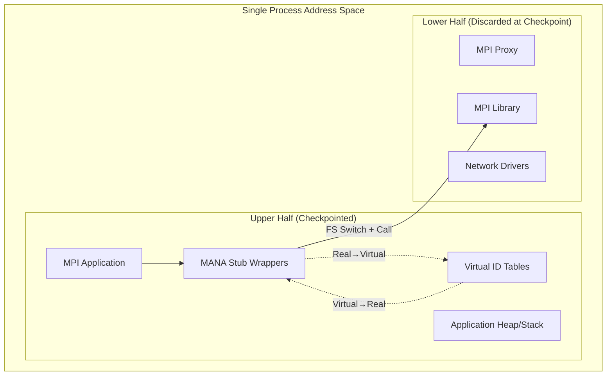
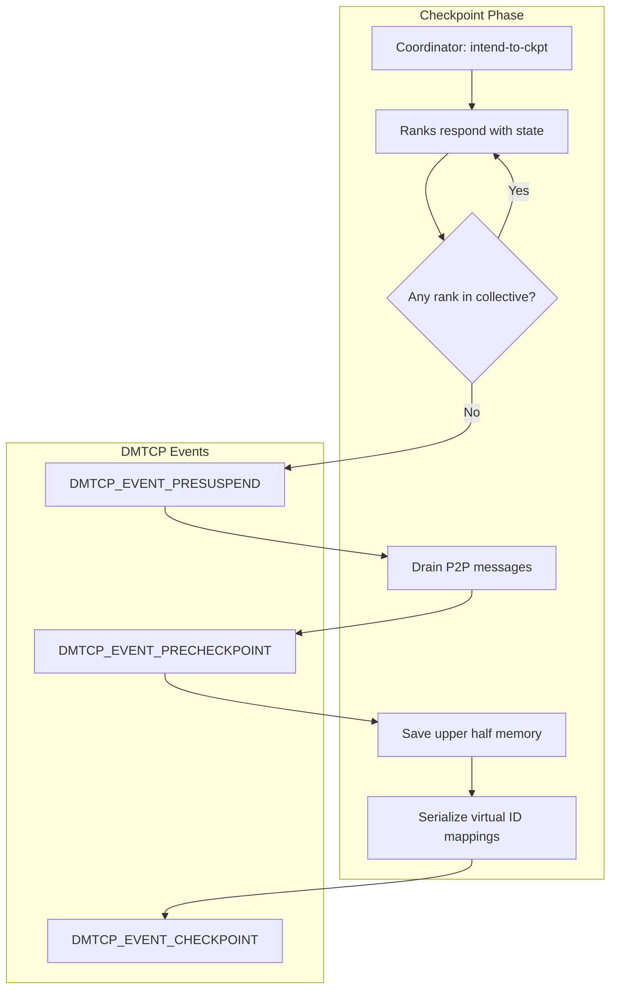
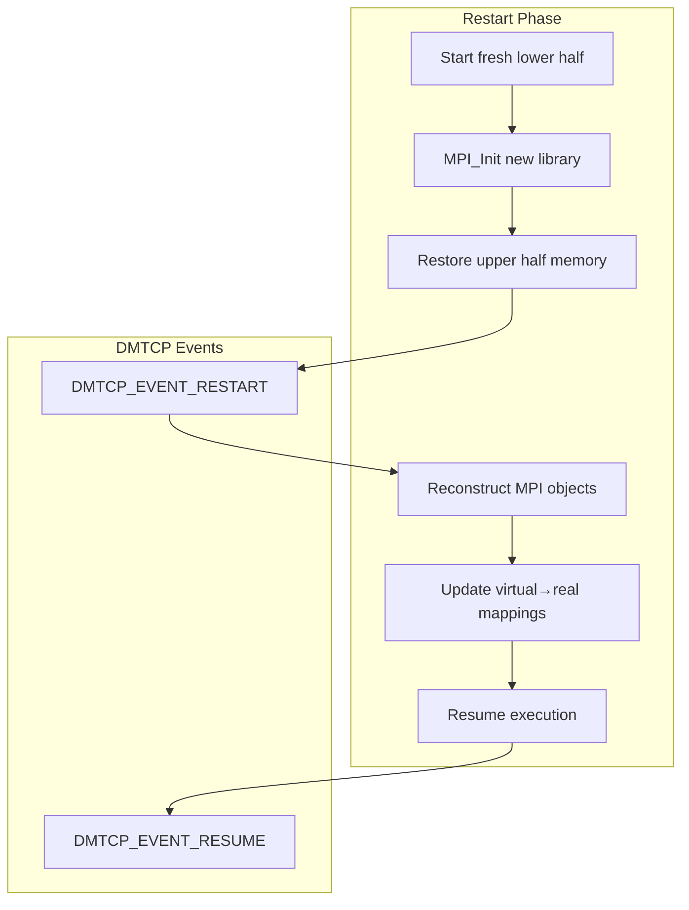

# MANA Contributor Documentation

## 1. Executive Summary

MANA (MPI-Agnostic Network-Agnostic Checkpointing) enables transparent checkpoint-restart for MPI applications across any MPI implementation and network fabric. Built as a plugin on top of DMTCP, MANA's key innovation is the **split-process architecture** that separates the MPI application from the actual MPI library, allowing checkpoint under one MPI implementation and restart under another.

**Target audience**: Developers contributing to MANA, researchers studying checkpoint-restart systems, and HPC system administrators deploying transparent checkpointing.

## 2. Architecture Overview

### 2.1 Split-Process Model

MANA's fundamental innovation is the split-process architecture where a single system process contains two independent programs in the same virtual address space:



**Key Components:**

- **Upper Half**: Contains the MPI application, its data (stack/heap), and MANA's stub wrapper library. This half is checkpointed and restored.
- **Lower Half**: A minimal MPI proxy application linked with the actual MPI library and network drivers. This half is discarded at checkpoint and recreated fresh on restart.

**Benefits:**
- **MPI-Agnosticism**: Checkpoint under Cray MPICH, restart under Open MPI
- **Network-Agnosticism**: Checkpoint over TCP, restart over InfiniBand  
- **Reduced checkpoint size**: Network state never saved

### 2.2 Memory Organization

The split-process is implemented in `mpi-proxy-split/lower-half/lower-half.cpp` with the `LowerHalfInfo_t` structure (`lower-half/lower-half-api.h:45`) coordinating between halves:

```c
typedef struct _LowerHalfInfo {
  void *fsaddr; // FS register base of lower half
  int fsgsbase_enabled;
  void *mmap, *munmap; // Memory management functions
  void *lh_dlsym; // Symbol resolution function
  char *uh_stack_start, *uh_stack_end; // Upper half stack bounds
  // MPI constants for virtualization...
} LowerHalfInfo_t;
```

### 2.3 DMTCP Plugin Integration

MANA integrates with DMTCP through event hooks in `mpi_proxy-split/mpi_plugin.cpp:809`:

- `DMTCP_EVENT_INIT`: Initialize MANA subsystems
- `DMTCP_EVENT_PRESUSPEND`: Drain collectives and P2P messages
- `DMTCP_EVENT_PRECHECKPOINT`: Save MPI state and virtual ID mappings
- `DMTCP_EVENT_RESTART`: Reconstruct MPI objects and restore state
- `DMTCP_EVENT_RESUME`: Reset counters and resume execution

## 3. Core Subsystems

### 3.1 MPI Wrapper System

MANA intercepts all MPI calls through wrapper functions in `mpi-proxy-split/mpi-wrappers/`:

**Wrapper Categories:**
- **Point-to-point**: `mpi_p2p_wrappers.cpp` (Send, Recv, Isend, Irecv)
- **Collective**: `mpi_collective_wrappers.cpp` (Barrier, Bcast, Allreduce)
- **Communicator**: `mpi_comm_wrappers.cpp` (Comm_create, Comm_split)
- **Datatype**: `mpi_type_wrappers.cpp` (Type_commit, Type_contiguous)
- **Request**: `mpi_request_wrappers.cpp` (Wait, Test, Request_free)

**Wrapper Pattern** (example from `mpi_collective_wrappers.cpp:59`):
```c
int PMPI_Bcast(void *buffer, int count, MPI_Datatype datatype,
              int root, MPI_Comm comm) {
  commit_begin(comm);  // Collective safety protocol
  DMTCP_PLUGIN_DISABLE_CKPT();
  MPI_Comm real_comm = get_real_id((mana_mpi_handle){.comm = comm}).comm;
  MPI_Datatype real_datatype = get_real_id((mana_mpi_handle){.datatype = datatype}).datatype;
  JUMP_TO_LOWER_HALF(lh_info->fsaddr);
  retval = NEXT_FUNC(Bcast)(buffer, count, real_datatype, root, real_comm);
  RETURN_TO_UPPER_HALF();
  DMTCP_PLUGIN_ENABLE_CKPT();
  commit_finish(comm);
  return retval;
}
```

**Key Mechanisms:**
- `JUMP_TO_LOWER_HALF/RETURN_TO_UPPER_HALF`: Switch FS register for TLS
- `get_real_id()`: Translate virtual to real MPI handles
- `NEXT_FUNC()`: Call actual MPI function in lower half
- `DMTCP_PLUGIN_DISABLE_CKPT()`: Prevent checkpoint during critical sections

### 3.2 Virtual ID Management

MPI objects cannot persist across restart because the lower-half MPI library generates new handles. MANA solves this with virtualization implemented in `mpi-proxy-split/virtual_id.cpp`:

**Virtualized Objects:**
- `MPI_Comm` (communicators)
- `MPI_Group` (process groups) 
- `MPI_Datatype` (derived datatypes)
- `MPI_Op` (reduction operations)
- `MPI_Request` (non-blocking handles)
- `MPI_File` (MPI-IO handles)

**Data Structures** (`virtual_id.h:10`):
```c
typedef union {
  int _handle;
  int64_t _handle64;
  MPI_Comm comm;
  MPI_Group group;
  MPI_Request request;
  MPI_Op op;
  MPI_Datatype datatype;
  MPI_File file;
} mana_mpi_handle;

extern std::map<int, virt_id_entry*> virt_ids;
```

**Virtual ID Creation** (`virtual_id.cpp:34`):
```c
MPI_Comm new_virt_comm(MPI_Comm real_comm) {
  // Get communicator size, rank, and global ranks
  JUMP_TO_LOWER_HALF(lh_info->fsaddr);
  NEXT_FUNC(Comm_size)(real_comm, &desc->size);
  NEXT_FUNC(Comm_rank)(real_comm, &desc->rank);
  NEXT_FUNC(Comm_group)(real_comm, &local_group);
  NEXT_FUNC(Group_translate_ranks)(local_group, desc->size, local_ranks,
                                   g_world_group, desc->global_ranks);
  RETURN_TO_UPPER_HALF();
  
  // Generate globally unique ID (ggid)
  unsigned int ggid = generate_ggid(desc->global_ranks, desc->size);
  
  // Create virtual handle and update mappings
  mana_mpi_handle virt_id = add_virt_id((mana_mpi_handle){.comm = real_comm}, 
                                        desc, MANA_COMM_KIND);
  ggid_table[virt_id.comm] = ggid;
  return virt_id.comm;
}
```

### 3.3 Checkpoint Safety (Collective Protocol)

The core invariant: **"No checkpoint may occur while any MPI rank is inside a collective communication call."**

MANA implements the **Collective Clock (CC) algorithm** in `mpi-proxy-split/seq_num.cpp`:

**Key Data Structures** (`seq_num.h:28`):
```c
extern std::unordered_map<unsigned int, unsigned long> seq_num;
extern std::unordered_map<unsigned int, unsigned long> target;
extern std::unordered_map<MPI_Comm, unsigned int> ggid_table;
```

**Collective Wrapper Pattern** (`mpi_collective_wrappers.cpp:62`):
```c
int PMPI_Bcast(...) {
  commit_begin(comm);  // Enter collective, increment sequence number
  // ... actual MPI_Bcast call ...
  commit_finish(comm); // Exit collective, broadcast new target
}
```

**Checkpoint Coordination** (`mpi_plugin.cpp:894`):
```c
case DMTCP_EVENT_PRESUSPEND: {
  mana_state = CKPT_COLLECTIVE;
  drain_mpi_collective();  // Wait for all ranks to exit collectives
  dmtcp_global_barrier("MPI:Drain-Send-Recv");
  mana_state = CKPT_P2P;
  drainSendRecv();  // Drain point-to-point messages
}
```

## 4. Checkpoint/Restart Walkthrough

### 4.1 Checkpoint Flow



**Step-by-Step Process:**

1. **Coordinator Intent** (`mana_coordinator --checkpoint`):
   - Coordinator sends checkpoint intent to all ranks
   - Ranks respond with current collective state

2. **DMTCP_EVENT_PRESUSPEND** (`mpi_plugin.cpp:894`):
   ```c
   mana_state = CKPT_COLLECTIVE;
   drain_mpi_collective();  // seq_num.cpp:75
   dmtcp_global_barrier("MPI:Drain-Send-Recv");
   mana_state = CKPT_P2P;
   drainSendRecv();  // p2p_drain_send_recv.cpp
   ```

3. **Collective Draining** (`seq_num.cpp:75`):
   - Each rank broadcasts its sequence numbers for all communicators
   - Ranks wait until all sequence numbers reach target values
   - Ensures no rank is inside a collective operation

4. **P2P Message Draining** (`p2p_drain_send_recv.cpp`):
   - Count outstanding messages per sender-receiver pair
   - `MPI_Alltoall` to verify message counts match
   - `MPI_Iprobe` + `MPI_Recv` to drain all outstanding messages

5. **DMTCP_EVENT_PRECHECKPOINT** (`mpi_plugin.cpp:908`):
   ```c
   recordMpiInitMaps();  // Save MPI initialization state
   recordOpenFds();      // Save file descriptor state
   save_mana_header(file);  // Save MANA metadata
   save_mpi_files(file2);   // Save MPI object reconstruction info
   ```

6. **DMTCP_EVENT_CHECKPOINT**:
   - Only upper-half memory saved (application + wrappers + virtual ID tables)
   - Lower half (MPI proxy + network state) discarded

### 4.2 Restart Flow



**Step-by-Step Process:**

1. **Fresh Lower Half Start** (`lower-half/lower-half.cpp`):
   - New process with fresh MPI library and network drivers
   - No network state carried over from checkpoint

2. **DMTCP_EVENT_RESTART** (`mpi_plugin.cpp:947`):
   ```c
   reset_wrappers();
   initialize_wrappers();
   init_predefined_virt_ids();
   reconstruct_descriptors();  // virtual_id.cpp:95
   restoreMpiLogState();       // record-replay.cpp:71
   replayMpiP2pOnRestart();    // p2p_log_replay.cpp
   restore_mpi_files(file);    // Restore MPI object info
   ```

3. **Virtual ID Reconstruction** (`virtual_id.cpp:95`):
   - Predefined MPI constants recreated (MPI_COMM_WORLD, etc.)
   - Virtual ID tables rebuilt with new real handles from fresh MPI library
   - Application continues using same virtual handles

4. **MPI Object Reconstruction** (`record-replay.cpp:77`):
   - **Communicators**: Replayed via `MPI_Comm_split`/`MPI_Comm_create_group`
   - **Datatypes**: Reconstructed via `MPI_Type_xxx` calls using saved envelopes
   - **Groups**: Rebuilt from saved membership lists
   - **Operations**: Recreated with saved user functions

5. **P2P State Replay** (`p2p_log_replay.cpp`):
   - If `MANA_P2P_LOG` was enabled during checkpoint
   - Replay point-to-point operations in deterministic order
   - Ensures message matching consistency across restart

6. **DMTCP_EVENT_RESUME** (`mpi_plugin.cpp:935`):
   ```c
   resetDrainCounters();  // Clear message counters
   seq_num_reset();        // Reset collective sequence numbers
   mana_state = RUNNING;   // Back to normal execution
   ```

## 5. Key Source Files Reference

| File | Purpose | Key Functions |
|------|---------|---------------|
| `mpi-proxy-split/mpi_plugin.cpp` | DMTCP plugin event handlers | `dmtcp_event_hook()` |
| `mpi-proxy-split/virtual_id.cpp` | Virtual ID management | `new_virt_comm()`, `get_real_id()` |
| `mpi-proxy-split/seq_num.cpp` | Collective safety protocol | `commit_begin()`, `drain_mpi_collective()` |
| `mpi-proxy-split/lower-half/lower-half.cpp` | Split-process initialization | Lower half setup and memory management |
| `mpi-proxy-split/mpi-wrappers/mpi_collective_wrappers.cpp` | Collective operation wrappers | `PMPI_Barrier()`, `PMPI_Bcast()` |
| `mpi-proxy-split/record-replay.cpp` | MPI object reconstruction | `restoreTypes()`, `restoreMpiLogState()` |
| `mpi-proxy-split/p2p_drain_send_recv.cpp` | P2P message draining | `drainSendRecv()`, `resetDrainCounters()` |
| `mpi-proxy-split/uh_wrappers.cpp` | Upper-half system call wrappers | `mmap()`, `munmap()` with checkpoint safety |

## 6. Development Guide

### 6.1 Building MANA

```bash
git clone https://github.com/mpickpt/mana
cd mana
git submodule init
git submodule update
./configure --enable-debug
make -j8
```

**Key Build Targets:**
- `make mana`: Build MANA plugin and tools
- `make test`: Run regression tests
- `make install`: Install to system prefix

### 6.2 Running Tests

```bash
# Start coordinator
bin/mana_coordinator -i10  # Checkpoint every 10 seconds

# Run test application
srun -N 2 bin/mana_launch mpi-proxy-split/test/mpi_hello_world.mana.exe

# Restart from checkpoint
srun -N 2 bin/mana_restart
```

**Test Categories:**
- `mpi-proxy-split/test/`: MPI functionality tests
- `mpi-proxy-split/unit-test/`: Unit tests for subsystems
- `test/`: Integration tests with DMTCP

### 6.3 Debugging Techniques

**Environment Variables:**
- `MANA_DEBUG=1`: Print debug information
- `DMTCP_MANA_PAUSE=1`: Pause early for GDB attach
- `DMTCP_RESTART_PAUSE=1`: Pause during restart
- `MPI_COLLECTIVE_P2P=1`: Translate collectives to P2P (debug mode)
- `MANA_P2P_LOG=1`: Log P2P calls for deterministic replay

**GDB Usage:**
```bash
# Attach to paused process
gdb -p <PID>

# Load MANA symbols
source util/gdb-dmtcp-utils
load-symbol-library libmana.so

# Switch between upper/lower halves
file bin/lh_proxy              # Lower half symbols
file mpi_hello_world.mana.exe  # Upper half symbols
```

**Common Debugging Scenarios:**
1. **Split-process issues**: Set `DMTCP_MANA_PAUSE=1` and break at `splitProcess()`
2. **Virtual ID problems**: Examine `virt_ids` map in GDB
3. **Collective deadlocks**: Check sequence numbers with `print_seq_nums()`
4. **P2P message mismatches**: Enable `MANA_P2P_LOG` and examine logs

## 7. Glossary

**Upper Half**: The checkpointed portion containing the MPI application and MANA wrappers.

**Lower Half**: The discarded portion containing the actual MPI library and network drivers.

**Virtual ID**: MANA-managed handle that maps to real MPI handles, persisting across restarts.

**GGID (Globally Unique ID)**: Hash-based identifier for MPI communicators derived from member ranks.

**Split-Process**: MANA's architecture where two independent programs share one virtual address space.

**FS Register**: x86-64 segment register used for thread-local storage, switched between halves.

**Two-Phase-Commit**: Original collective safety algorithm (replaced by Collective Clock).

**Collective Clock (CC)**: Current collective safety algorithm using sequence numbers per communicator.

**P2P Draining**: Process of ensuring all point-to-point messages are delivered before checkpoint.

**Record-Replay**: Mechanism for reconstructing MPI objects at restart from saved creation calls.

---

*This documentation is based on MANA version as of repository commit. For the latest updates, see the MANA repository at https://github.com/mpickpt/mana and the academic publications: HPDC'19, SC Workshops'21, Cluster'24, and SuperCheck-SC'23.*